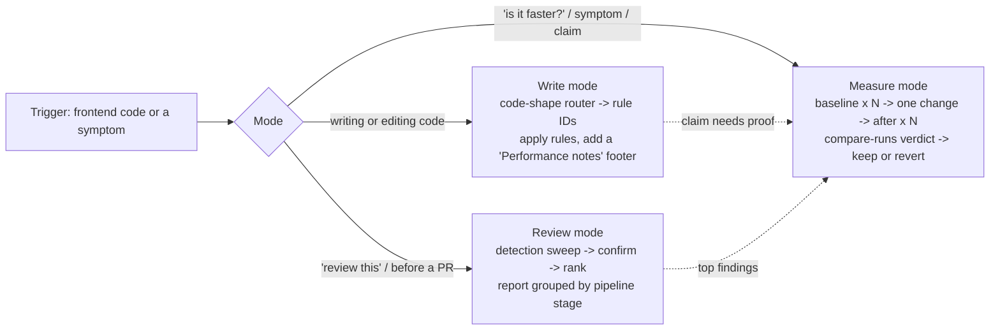
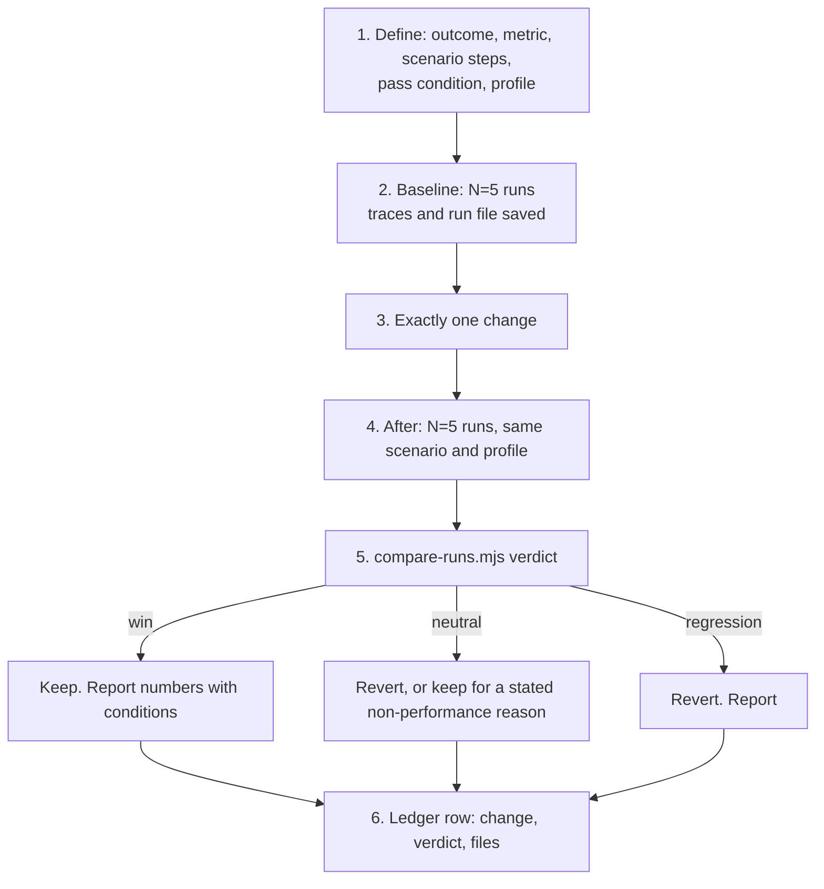

# Design C: outcome first (symptom and metric), with verification discipline

- Skill: `~/.claude/skills/web-performance/` (user level, all projects)
- Date: 2026-09-22
- Angle: C. The primary axis is the **outcome the user feels and a metric can prove**. Measurement and the review report are first-class parts of the skill, not appendices.
- Inputs read: `18-skills-survey-github.md` and `18-skills-survey-web.md` (in full); the headings of all notes files; item bodies in 01, 03, 06, 10, 12, 13; `verify/01-critical-rendering-path.verify.md`; raw DevTools MCP tool reference (`raw/cdmcp-tools.md`, `raw/cdmcp-config.md`); raw WebMCP docs; raw SciChart typings (`raw/scichart/*.d.ts`).
- Evidence counts used below come from a script over the notes (`- Metrics:` and `- Stage:` lines, 584 items in 13 files).

---

## 0. Summary in one screen

The skill answers one question first: **"Which outcome is at risk, and how will we prove it got better?"** Six outcomes are the primary axis. Every rule has exactly one home outcome, a pipeline **Stage** tag, a **Layer** tag (the user's own categories), a static **Detect** pattern, and a **Verify** recipe with a pass condition.

| Outcome (ID prefix) | The user sees | The metric that proves it |
|---|---|---|
| Loading (`LOAD`) | blank screen, late hero or first chart | LCP and its 4 subparts, FCP, TTFB |
| Responsiveness (`INP`) | click or key feels late, UI freezes | INP and its 3 subparts, long tasks, LoAF |
| Visual stability (`CLS`) | content jumps, flicker, pop-in | CLS, per-interaction non-input shift |
| Smoothness (`FPS`) | pan, zoom, drag, or stream stutters | frame interval p95, long frames, max frame gap |
| Memory (`MEM`) | tab gets slow or crashes after hours or after N symbol switches | heap and native memory slope per repeated action, DOM/canvas/context counts |
| Bundle and startup (`START`) | slow to become usable, big download | JS bytes on the first route, script evaluation time, wasm and shader init time |

Three modes use the same rule base:



Why this is different from a stage-first or layer-first design: the outcome makes every rule answer "which metric does this move?" A rule that cannot name a metric and a pass condition does not get into the skill. This is the main defense against the "use proper X" no-op rules found in the surveys.

---

## 1. Classification axis

### 1.1 Primary axis: outcome

Six outcomes, listed in the table above. The boundaries:

- **Loading vs startup.** Loading is about *what arrives when and what blocks the first render* (network, discovery, priority, render-blocking CSS, images, fonts). Startup is about *how much code must run before the app is usable* (bytes, parse, compile, evaluation, wasm init, shader and pipeline creation). A 400 KB chart library is a startup rule; its `<script>` attribute is a loading rule.
- **Responsiveness vs smoothness.** INP measures discrete interactions only (click, tap, key). web.dev (quoted in `06`, "Diagnose INP by subpart"): "Scroll, hover, and zoom are not measured." Chart pan, zoom, crosshair and drag-move are therefore **smoothness**, not INP. This split matters for a trading terminal, where the most frequent interactions are continuous.
- **Stability includes flicker.** CLS covers layout shift. The same file also covers visual flicker and pop-in (canvas cleared on resize, a pane rebuilt on data change), because the user sees the same symptom ("it jumps") and the fix is also "keep identity and reserve space".
- **Memory includes native and GPU memory.** WebAssembly linear memory (SciChart) and GPU memory do not show in the JS heap. They belong to the same outcome because the symptom and the proof method (slope over repeated actions) are the same.

### 1.2 Why outcome first (reasoning)

1. **Symptoms arrive as outcomes.** Users say "the chart stutters when I drag" or "memory grows after switching symbols". The outcome map routes such a sentence to one file and one measurement recipe in one step.
2. **Verification is built in.** Each outcome owns a metric, so each rule inherits a natural pass condition. The surveys show this is the gap in most skills: the Copilot rule set has detection regexes but no verification; the Cursor collections have neither (`18-skills-survey-github.md`, lessons 4 and 5).
3. **The notes are already tagged by metric.** Every item has a `Metrics:` line. Counts: FPS/smoothness 280, LCP 269, INP 261, FCP 158, memory 143, TBT 74, CLS 66, bundle-size 61, TTFB 51, startup 50. Classification is mechanical (first metric = default home), then reviewed.
4. **The terminal is a long-lived SPA.** Loading happens once per session. Smoothness, responsiveness and memory matter all day. An outcome axis lets SKILL.md weight them for this user (the router and the "defaults to override" list lean to FPS, INP and MEM) without deleting loading knowledge.
5. **It kills premature micro-optimization.** A V8 micro-rule must name the outcome it moves and pass the "profiled hot path" gate. Without an outcome, such rules become noise (Vercel's `js-` rules, `18-skills-survey-github.md`).

The cost of this axis, and the fix:

- **At write time Claude knows the code shape, not the outcome.** It is writing a `pointermove` handler, not "an FPS problem". Fix: a **code-shape router** in SKILL.md (section 4) maps each code shape to rule IDs in their home files. Claude reads only those rules with `grep -n '^### FPS-18 '`.
- **The user wants review findings grouped by pipeline stage.** Fix: every rule carries a `Stage` tag, and the review template groups by stage (section 7). The outcome stays visible on each finding.

### 1.3 Secondary tags (on every rule)

| Tag | Values | Purpose |
|---|---|---|
| `Stage` | `network`, `html-parse`, `preload-scan`, `cssom`, `script-compile`, `script-run`, `microtask`, `main-thread-task`, `idle`, `style`, `layout`, `paint`, `raster`, `composite`, `gpu-upload`, `gpu-draw`, `gc-memory` (the 17 tags already used in the notes) | Groups review findings; links each rule to `pipeline.md` |
| `Layer` | `html`, `css`, `js`, `v8`, `canvas2d`, `gpu`, `network`, `build`, `tooling` | The user's own knowledge categories; `grep 'Layer: .*css'` gives "all CSS rules" |
| `When` | `load`, `interaction`, `animation/render-loop`, `long-lived session`, `build`, `testing` | Tells if the rule is on a hot path |
| `Impact` | `high`, `medium`, `low` + a one-clause reason | Ranking in review and in the router |
| Surface | implied by the file: web platform, `canvas-gpu.md`, `scichart.md` | Keeps GPU and SciChart rules together for write-time loading |

Stage tags collapse into 10 report groups for the review report:

| Report group | Stage tags |
|---|---|
| Network | `network` |
| Parse and discovery | `html-parse`, `preload-scan`, `cssom` |
| Script compile and evaluate | `script-compile` |
| Tasks and event loop | `main-thread-task`, `script-run`, `microtask`, `idle` |
| Style | `style` |
| Layout | `layout` |
| Paint and raster | `paint`, `raster` |
| Composite | `composite` |
| GPU upload and draw | `gpu-upload`, `gpu-draw` |
| Memory and lifecycle | `gc-memory` |

### 1.4 Where the user's categories live

| User category | Where it lives in this design |
|---|---|
| Critical rendering path phases (first HTML bytes to paint) and what code affects each | `references/pipeline.md` (the backbone: phases, threads, blocking conditions, controlling code, DevTools event names), plus the `Stage` tag on every rule and the stage-grouped review report |
| HTML directives that load early or lazily | `loading.md` §B–§E (`LOAD-01`…`LOAD-20`); support dates in `support.md` |
| CSS (GPU, layers, `will-change`, `contain`) | `smoothness.md` §B–§D (`FPS-06`…`FPS-17`); style scope in `responsiveness.md` §D; space reservation in `stability.md` |
| JS (event loop, micro/macro tasks, rAF, rIC, Web APIs) | slot model in `pipeline.md` §B; rules in `responsiveness.md` §B–§F, `smoothness.md` §A/§E/§F, `memory.md` §A |
| Micro-optimizations (V8 blog) | `responsiveness.md` §G "Hot-path JavaScript" (gated: profiled hot function only); startup parts in `startup.md` §B |
| GPU (WebGL/WebGPU textures, shaders, data types) | `canvas-gpu.md` (one rule per idea, with a WebGL2 line and a WebGPU line) and `scichart.md` |
| Chrome DevTools MCP and WebMCP for performance testing | `measure.md` + `scripts/` (fixed probes, trace summary, run comparison) |

### 1.5 Home rule for rules that touch several outcomes

A rule lives in **one** file. Its home is the outcome where the failure is **measured first** for this user's apps. Other outcomes appear in the `Outcome:` line as `also:` and in their files as a one-line cross-reference (`See FPS-06.`), never as a copy. Examples:

| Rule idea | Outcomes touched | Home | Reason |
|---|---|---|---|
| Animate transform, not geometry | FPS, CLS | `FPS-06` | The stutter is seen before the shift |
| Batch layout reads before writes | INP, FPS | `INP-13` | Forced reflow shows in the INP processing subpart and the ForcedReflow insight |
| Size the canvas backing store only on change | CLS (flicker), MEM, FPS | `GPU-CLS-01` | The visible failure is flicker or blur |
| Close sockets on `pagehide` | LOAD (bfcache), MEM | `LOAD-24` | bfcache restore is a loading outcome |
| `appendRange` once per frame | FPS, INP, MEM | `SC-FPS-01` | Frame cadence is the first symptom at market open |

---

## 2. Directory tree

```
~/.claude/skills/web-performance/
├── SKILL.md                  ~250  Loaded on trigger. Modes, honesty rules, outcome map, code-shape
│                                    router, defaults to override, budgets, output formats, file index.
├── references/
│   ├── pipeline.md           ~220  Stage glossary. Initial load (bytes to pixels) and the update frame,
│   │                                threads, what blocks each phase, what code controls it, DevTools
│   │                                trace event names, stage -> outcome map.
│   ├── loading.md            ~400  LOAD-01..26. LCP subpart diagnosis, discovery and priority,
│   │                                render-blocking CSS/JS, images, fonts, next navigations, bfcache.
│   ├── responsiveness.md     ~450  INP-01..32. INP subpart diagnosis, input delay, processing
│   │                                (yield, workers, abort), presentation delay (forced layout, DOM,
│   │                                style scope), event wiring, messaging, hot-path JS (V8).
│   ├── stability.md          ~180  CLS-01..10. Reserve space, late content, font metrics, flicker and
│   │                                pop-in on canvas surfaces and panes.
│   ├── smoothness.md         ~380  FPS-01..25. Frame budget and rAF, compositor-only motion and layers,
│   │                                containment, paint cost, input to frame, pausing hidden work,
│   │                                off-main-thread rendering.
│   ├── memory.md             ~260  MEM-01..15. Ownership and teardown, DOM and closures, bounded data,
│   │                                native and GPU memory budgets, field memory.
│   ├── startup.md            ~250  START-01..15. Ship less JS, evaluation cost, engines/wasm/workers,
│   │                                third parties.
│   ├── canvas-gpu.md         ~480  GPU-<OUTCOME>-nn. Renderer contract; Canvas 2D, WebGL2, WebGPU rules
│   │                                grouped by outcome; WebGL -> WebGPU difference table.
│   ├── scichart.md           ~330  SC-<OUTCOME>-nn. Lookup order (installed typings first), chart
│   │                                contract, SciChart.js v5 rules grouped by outcome, v6 readiness.
│   ├── measure.md            ~400  Output mode 3. The before/after loop, lab profiles, driving scenarios
│   │                                (MCP input, WebMCP, dev hooks), recipes per outcome, probes,
│   │                                comparison and verdict, field data, token hygiene.
│   ├── review.md             ~200  Output mode 2. Procedure, detection sweep, severity scale, report
│   │                                template grouped by pipeline stage, one worked finding.
│   └── support.md            ~220  The only place with browser versions and dates. Support table keyed
│                                    by web-features id, engine facts, tool facts (MCP flags, insight
│                                    names, WebMCP API shape), library versions, deprecations, myths,
│                                    watch list. "Checked" date and refresh procedure.
├── scripts/
│   ├── probes.js             ~220  One idempotent function for evaluate_script. Installs
│   │                                window.__wpProbe with frame, interaction, shift and memory probes.
│   ├── trace-summary.mjs     ~130  Reads a saved .json.gz trace; counts and sums main-thread events
│   │                                (Layout, UpdateLayoutTree, Paint, FireAnimationFrame, EventDispatch,
│   │                                EvaluateScript...) overall or between two performance marks.
│   ├── compare-runs.mjs      ~100  Compares two run files (median, MAD, delta) and prints a verdict:
│   │                                win, neutral, regression, or insufficient runs.
│   └── lint-skill.mjs        ~90   Maintainer check: unique IDs, cross-references resolve, Support keys
│                                    exist, no browser versions outside support.md, size limits, TOCs.
└── evals/
    └── evals.json            ~90   4 task evals with assertions + 3 trigger near-misses.
```

Total about 4,450 lines. Only SKILL.md (about 250 lines, about 3,500 tokens) loads on trigger. A typical write task then reads 3–8 rules by ID (about 1,500 tokens), not whole files.

The research notes and the note-to-rule crosswalk stay in the research folder. They do not ship in the skill.

---

## 3. Frontmatter (exact)

```yaml
---
name: web-performance
description: >-
  Frontend performance rules, review reports, and before/after measurement for web apps and
  WebGL/WebGPU trading charts built with SciChart.js v5. Use this skill whenever you write,
  change, or review HTML, CSS, JS/TS, Svelte components, canvas, WebGL/WebGPU or shader code,
  workers, data feeds, or chart code, even when nobody says "performance": ordinary code (a
  pointermove handler, a layout read after a style write, a per-tick dataset replace, a missing
  teardown) causes most slowdowns. Rules are grouped by outcome: loading (LCP), responsiveness
  (INP), visual stability (CLS), smoothness (frame rate), memory and leaks, bundle and startup.
when_to_use: >-
  Also use it when the user reports a symptom: slow first load, laggy clicks or typing, layout
  shift, flicker or pop-in, jank or dropped frames while panning, zooming, dragging, or
  streaming, memory growth after repeated actions, a large bundle, or slow startup. Use it to
  write a performance review report, and to prove a change with Chrome DevTools MCP (baseline
  trace, one change, re-trace, compare). Do not use it for backend, database, CI, or
  infrastructure work unless that work changes what the browser downloads or runs.
paths:
  - "**/*.html"
  - "**/*.css"
  - "**/*.scss"
  - "**/*.js"
  - "**/*.mjs"
  - "**/*.ts"
  - "**/*.tsx"
  - "**/*.jsx"
  - "**/*.svelte"
  - "**/*.glsl"
  - "**/*.wgsl"
  - "**/*.vert"
  - "**/*.frag"
---
```

Checks done on this text:

- `description` is 642 characters and `when_to_use` is 526 characters: 1,168 together, under the 1,536-character listing cap cited in both surveys (code.claude.com/docs/en/skills).
- The description starts with the write-time task, not with audit phrases. Both surveys found that audit-phrased triggers do not fire while Claude writes a component (Vercel eval: the skill was not invoked in 56% of cases with default triggering).
- `paths` limits auto-activation to matching files; it does not force activation. Keep it only if the trigger evals in section 10 show no drop for symptom prompts (see risk R2). The accepted `paths` syntax (YAML list vs comma string) must be checked against the Claude Code skills doc before publishing; `lint-skill.mjs` parses the frontmatter.
- Companion pointer (outside the skill, recommended): 3 lines in `~/.claude/CLAUDE.md`: "Before you write or review HTML, CSS, JS/TS, Svelte, canvas, WebGL/WebGPU or chart code, load the web-performance skill. Explore the target code first, then apply it." Vercel measured 53% → 79% with explicit instructions, and "explore first, then invoke" beat "MUST invoke first" (`18-skills-survey-web.md`).

---

## 4. SKILL.md outline

### 4.1 Sections and line budgets

| # | Heading | Contents | Lines |
|---|---|---|---|
| 1 | frontmatter | Section 3 | 30 |
| 2 | `# Web performance` | Four lines: outcome first; three modes; one rule base; honesty. | 6 |
| 3 | `## Pick the mode` | Table: signal in the request → mode → output. Diagnosis ("find why…") is read-only: report cause and proposed fix; change code only when asked. | 14 |
| 4 | `## Honesty rules` | Six bullets (4.2). | 12 |
| 5 | `## Explore first, then apply` | Read the target code and its callers; read installed library versions and typings (`node_modules/scichart/package.json`, `.d.ts`); name the code shapes; name the outcomes at risk; then open rules. | 10 |
| 6 | `## Outcome map` | Table 4.3. | 16 |
| 7 | `## Code-shape router` | Table 4.4 (the routing table). | 34 |
| 8 | `## Defaults to override` | Numbered list 4.5 (agent default mistakes, each with rule IDs). | 24 |
| 9 | `## Budgets and the chart contract` | Numbers 4.6 and the chart contract fields. | 26 |
| 10 | `## Write mode: output` | Footer format 4.7 and when to skip it. | 14 |
| 11 | `## Review mode` | Five steps; "open `references/review.md` for the procedure and template". | 10 |
| 12 | `## Measure mode` | Seven-step loop; "open `references/measure.md`"; the verdict rule in one line. | 14 |
| 13 | `## Browser support and other dated facts` | Never quote a browser version, Baseline status, API shape or tool flag from memory. Read the row in `support.md`, say its "Checked" date. If the date is older than 6 months, say so and offer to refresh. | 8 |
| 14 | `## How to read the references` | Read rules by ID (`grep -n '^### INP-13 ' references/responsiveness.md`, then read about 20 lines). File index with one "open when" line per file. | 22 |
| 15 | `## Maintenance` | "After editing this skill, run `node scripts/lint-skill.mjs`." | 3 |
| | | **Total** | **~250** |

### 4.2 Honesty rules (full text, section 4 of SKILL.md)

1. A finding from reading code is a **hypothesis**. Label it "static, not measured" and name the recipe that would verify it.
2. Do not write "faster", "smooth", "60 fps", "GPU-accelerated so no jank", or a score, unless a recorded measurement supports it. State device profile, throttling, build type, and run count with any number.
3. Change one thing per measurement. Compare medians of at least 5 runs. A change that does not beat run-to-run noise is **neutral**: revert it, or keep it only for a stated non-performance reason.
4. Correctness gates the metric. A "win" that needs a test to change or a feature to drop is a regression.
5. Lab data cannot prove field INP. Claim a field improvement only after field data (RUM/CrUX) arrives.
6. If an insight or probe shows no problem, say that the code is already fast. Do not invent work.

Sources: Addy Osmani agent-skills and auditor ("metric-honesty rule", revert neutral changes), zero-jank-scroll "honest output", Cloudflare "skip non-issues", corewebvitals.io (lab vs field). All in the two survey files.

### 4.3 Outcome map (full table, section 6 of SKILL.md)

| Outcome | User sees | Metric, "good" | Stages that feed it | First levers | Rules | Measure |
|---|---|---|---|---|---|---|
| Loading `LOAD` | blank or skeleton screen; late hero or first chart | LCP ≤ 2.5 s p75; subparts TTFB ~40%, load delay <10%, load duration ~40%, render delay <10%; FCP ≤ 1.8 s | network, html-parse, preload-scan, cssom, script-compile, paint | LCP resource in markup, prioritized, not lazy; less render-blocking CSS/JS; first view not built by client JS | `loading.md` | `measure.md#load` |
| Responsiveness `INP` | click or key feels late; UI freezes | INP ≤ 200 ms p75; lab: worst interaction and its subparts; tasks ≤ 50 ms | main-thread-task, script-run, microtask, style, layout, paint | paint first, then yield; >250 ms work to a worker; no forced layout; small DOM and narrow style changes | `responsiveness.md` | `#inp` |
| Stability `CLS` | content jumps; flicker; pop-in | CLS ≤ 0.1; lab per interaction: non-input shift < 0.02 | layout, paint | reserve space; pre-sized slots; metric-matched fonts; keep pane identity | `stability.md` | `#cls` |
| Smoothness `FPS` | pan, zoom, drag, stream stutters | frame interval p95 ≤ 16.7 ms at 60 Hz (8.3 ms at 120 Hz); zero LoAF > 50 ms in the scenario; max frame gap < 75 ms | script-run, style, layout, paint, composite, raster, gpu-upload, gpu-draw | one rAF writer; coalesce input and ticks; compositor-only motion; render on demand; batch GPU work | `smoothness.md`, `canvas-gpu.md`, `scichart.md` | `#fps` |
| Memory `MEM` | slow after hours or after N repeated actions; crash | after warm-up, growth per repeated action within noise; DOM, canvas, context and surface counts back to baseline | gc-memory, gpu-upload | one teardown signal per owner; `delete()`/`destroy()` native and GPU objects; bounded caches and buffers | `memory.md` (+ §MEM of the surface files) | `#mem` |
| Startup `START` | slow to become usable; big download | JS bytes on the first route; script evaluation time; wasm and shader init time | network, script-compile, script-run, gpu-upload | `import()` for non-startup code; no legacy or duplicate JS; compile shaders and pipelines once, async | `startup.md` | `#start` |

Footnote line under the table: "INP does not measure scroll, hover or zoom. Chart pan, zoom and crosshair are Smoothness."

### 4.4 Code-shape router (the routing table, section 7 of SKILL.md)

Claude reads this table while it writes code. Each row gives rule IDs; Claude reads those rules by ID.

| You are writing or changing… | Check these rules | Open |
|---|---|---|
| `<head>`, `<script>`, `<link>`, preload/preconnect, fonts | LOAD-01, 04–06, 08–13, 18–20 | `loading.md` §B–§E |
| ``, `<picture>`, `<video>`, `<iframe>`, hero or LCP content | LOAD-02, 03, 14–17; CLS-01 | `loading.md` §B, §D; `stability.md` §A |
| CSS `transition`, `animation`, `@keyframes`, WAAPI `animate()` | FPS-06–12 | `smoothness.md` §B |
| CSS for panels, grids, lists; `:has()`; custom properties | FPS-13–15; INP-17–18; CLS-07 | `smoothness.md` §C; `responsiveness.md` §D |
| Late UI: banners, toasts, skeletons, async blocks | CLS-02–05, 08 | `stability.md` |
| `click`, `keydown`, `input`, `change`, `submit` handlers | INP-04–09, 11 | `responsiveness.md` §C |
| `pointermove`, `wheel`, `touchmove`, `scroll`, drag sessions, crosshair, hover | FPS-18–22; INP-20; SC-FPS-12 | `smoothness.md` §E |
| `getBoundingClientRect`, `offset*`, `client*`, `scroll*`, `getComputedStyle`, `innerText` | INP-13–15 | `responsiveness.md` §D |
| `requestAnimationFrame`, `setTimeout`/`setInterval`, polling, animation loops | FPS-01–05, 23–24; INP-02 | `smoothness.md` §A, §F |
| Long lists or tables; building large DOM | INP-16, 19; FPS-14 | `responsiveness.md` §D |
| Data processing: aggregation, indicators, sort, filter of big arrays | INP-05–06, 22–23; INP-26–32 only on a profiled hot path | `responsiveness.md` §C, §F, §G |
| WebSocket, SSE, fetch feeds, real-time ticks | INP-08, 24; MEM-01, 09; LOAD-24; SC-FPS-01 | `responsiveness.md` §F; `memory.md` |
| Reactive state (Svelte runes, stores) that holds big or fast data | INP-10 | `responsiveness.md` §C |
| Mount/unmount, subscriptions, observers, timers | MEM-01–05; FPS-23–24 | `memory.md` §A |
| Caches, Maps, memoization, IndexedDB, Cache Storage | MEM-08–11; INP-11 | `memory.md` §C |
| Workers, `postMessage`, OffscreenCanvas, SharedArrayBuffer | INP-22–25; FPS-25; START-13 | `responsiveness.md` §F |
| Canvas 2D drawing, text labels, overlays, hit testing | GPU-FPS-14, 15, 18; GPU-INP-02; GPU-CLS-01–02 | `canvas-gpu.md` |
| WebGL/WebGPU contexts, shaders, buffers, textures, pipelines | start with §0 contract, then the section of the outcome at risk | `canvas-gpu.md` |
| SciChart surfaces, data series, modifiers, annotations | `scichart.md` §0 first, then by outcome; `canvas-gpu.md` only for custom drawing | `scichart.md` |
| `import`, a new dependency, `import()`, bundler config, wasm | START-01–06, 11–12 | `startup.md` |
| Number/date formatting, JSON, object/array shapes in hot paths | INP-26–32 (profiled hot path only) | `responsiveness.md` §G |
| Route changes, service worker, page lifecycle | LOAD-23–26 | `loading.md` §G |

### 4.5 Defaults to override (section 8 of SKILL.md)

These are the mistakes agents make by default. Each line names the rule to read.

1. Happy-path render code: no teardown, no error path, 10 points of test data. → MEM-01, SC-MEM-01; test at the scale in the chart contract.
2. Rendering, setting state, or reading layout inside `pointermove`/`wheel` handlers. → FPS-18, INP-13
3. A layout read after a style write in the same task. → INP-13
4. `await Promise.resolve()` or `queueMicrotask` used as a "yield". → INP-05
5. `setTimeout`/`setInterval` to animate or to sequence animations. → FPS-05, FPS-11
6. Debounce as the default fix for scroll or pointer lag. → FPS-21
7. `will-change` or `translateZ(0)` left on permanently. → FPS-07
8. Animating `width`, `height`, `top`, `left`, or a blur radius. → FPS-06, FPS-10
9. Per-message `append`, whole-dataset replace per tick, or chart re-creation in a reactive block. → SC-FPS-01, SC-FPS-04, SC-MEM-01
10. New GPU objects or new JS arrays/objects every frame. → GPU-FPS-02, INP-32
11. Raw epoch milliseconds in a `Float32Array` or a float uniform. → GPU-FPS-10
12. `loading="lazy"` on the LCP image; preload or `fetchpriority="high"` on many resources. → LOAD-03, LOAD-04
13. A new dependency where a platform API exists (positioning, dialogs, animation, compression). → START-05
14. Deep reactive state for large arrays that are replaced as a whole. → INP-10
15. `performance.memory`, FID, TTI, or a Lighthouse score as the success metric. → `measure.md`, `support.md`
16. Browser support or Baseline status from memory. → `support.md`
17. "Faster", "60 fps" or "GPU-accelerated" without a measurement. → Honesty rules

Sources for the list: Mapbox "happy path only", LogRocket's Modern Web Guidance comparison (`setTimeout` sync, synchronous filtering, new dependency), TradingView (replace per tick, re-create per render), the stale-fact findings (FID, TTI, `performance.memory`), and the note files' "Deprecated and myths" lists.

### 4.6 Budgets and the chart contract (section 9 of SKILL.md)

- Frame: 16.7 ms at 60 Hz, 8.3 ms at 120 Hz. Keep main-thread work to about 10 ms of a 16.7 ms frame (web.dev, `01` §update frame). Read the refresh rate; do not assume 60 Hz.
- Task: 50 ms maximum. Size work first: under 50 ms, run it in place; 50–250 ms, slice it and yield on a 50 ms deadline; over 250 ms, use a worker (Modern Web Guidance heuristic, `18-skills-survey-web.md`).
- Core Web Vitals "good" at p75: LCP ≤ 2.5 s, INP ≤ 200 ms, CLS ≤ 0.1. Guides: FCP ≤ 1.8 s, TTFB ≤ 0.8 s (`03`, reference table).
- Lab per-interaction budgets, report-only at first: non-input CLS < 0.02, zero LoAF > 50 ms, max frame gap < 75 ms (dejank, `18-skills-survey-github.md`).
- Canvas memory: width × height × DPR² × 4 bytes × layers × instances. Default DPR cap 2.
- **Chart contract.** Before you build or change a chart feature, write these 8 values in a code comment or the plan: surfaces per view; series per surface; points per series (initial and maximum); update rate (normal and peak ticks per second); visible window; DPR cap; degradation policy (what drops first under load); teardown owner. The contract sets the test scale and the measurement scenario. (OpenAI dataviz and webgpu-skill "contracts", `18-skills-survey-github.md`, lesson 7.)

### 4.7 Write mode output (section 10 of SKILL.md)

After code that touches a hot path, a load path or a lifecycle, add a footer of at most 4 bullets:

```
Performance notes
- Chose: pointer input coalesced to one rAF per frame (FPS-18); label moved with transform (FPS-06).
- Trade-off: the label can trail the pointer by up to one frame; accepted to avoid forced layout.
- Not measured. To verify: measure.md#fps, drag scenario, frame probe p95.
```

Skip the footer when the change has no performance-relevant code (text, renames, types only). The footer names trade-offs, which is the user's requirement for output mode 1.

---

## 5. Reference files

Every outcome file starts with the same **outcome card** (about 30 lines): symptoms; metric and thresholds; stages (links to `pipeline.md`); a subpart diagnosis table where one exists (LCP 4 subparts, INP 3 subparts); a lever index (rule IDs in rank order); the detection command for this file (`grep -h '^- Detect:' references/<file>`); and the link to its measurement recipe. Files over 300 lines have a table of contents after the card.

Rule numbering below is the initial plan. IDs are stable once published; a removed rule leaves a gap and is never reused.

### 5.1 `pipeline.md` (~220 lines, stage glossary)

- **Scope.** The backbone: initial load from navigation to pixels (12 phases) and one update frame after load (spec order), the threads, what blocks each phase, what code controls it, the DevTools trace event names, and which outcome each stage feeds. No rules; rules link here with their `Stage` tag.
- **Fed by.** `01` phase map (tables a and b, threads), `verify/01` corrections (Paint Holding: FCP or 500 ms, extended cross-origin in 2021), `05` §E (which property changes cause layout, paint or only property-tree updates), `06` §A (task, microtask and rendering-step slots), `raw/TraceEvents.ts` for event names.
- **TOC.** §A Threads · §B Initial load phases table · §C Update frame table (input → event tasks → rAF → style/layout → ResizeObserver → intersections → paint → commit → raster → draw) · §D Event loop slots (task, microtask, rAF, idle; what runs when) · §E Property → pipeline cost table · §F Stage tag → outcome map · §G Trace event names (Layout, UpdateLayoutTree, Paint, FireAnimationFrame, EventDispatch, EvaluateScript, v8.compile) used by `trace-summary.mjs`.

### 5.2 `loading.md` (~400 lines, `LOAD`)

- **Scope.** First view: document, discovery, priority, render-blocking resources, images, fonts, and the next navigation.
- **Fed by.** `01` (navigation, head, preload scanner, CSSOM, scripts, fonts), `02` (all modules), `03` §C/§E/§F/§I, `04` (all), `05` §G–§H, `17` batches 1 and 3 (service worker and prefetch parts), `16-explore-fast-batch-*` (in progress: third parties, image CDNs, budgets), `verify/01`.
- **TOC.**
  - Outcome card + §A Diagnose LCP by subpart (subpart → DevTools insight → lever IDs)
  - §B Discovery and priority: LOAD-01 critical resources as plain tags in server HTML · LOAD-02 `` for the LCP image, not CSS background, `data-src` or JS-inserted · LOAD-03 `fetchpriority="high"` on the LCP image, never `loading="lazy"`, lower hidden above-fold images · LOAD-04 preload only late-discovered resources, with matching `as`/`crossorigin`/`imagesrcset` · LOAD-05 `modulepreload` or bundling for module waterfalls · LOAD-06 preconnect to at most 2 critical origins, `dns-prefetch` for the rest · LOAD-07 `priority` on `fetch()`
  - §C Render-blocking CSS and scripts: LOAD-08 `defer`/`type="module"`, `async` only for independent scripts · LOAD-09 no CSS `@import` · LOAD-10 small render-blocking CSS, split by route and `media` · LOAD-11 critical CSS inline only with a CSP-safe loader · LOAD-12 `blocking="render"` only for a known flash · LOAD-13 no `document.write`, no startup scripts injected from inline JS
  - §D Images and media: LOAD-14 display size × DPR (cap about 2×), `srcset`/`sizes`, AVIF/WebP with fallback · LOAD-15 native lazy loading below the fold, facades for heavy embeds · LOAD-16 video poster and `preload`, muted loop video instead of GIF · LOAD-17 `img.decode()` before inserting JS-created images
  - §E Fonts: LOAD-18 early discovery, preload 1–2 fonts with `crossorigin`, no `fetchpriority` on fonts · LOAD-19 WOFF2, subset, `unicode-range`, fewer files · LOAD-20 `font-display` by role (metric fallback lives in CLS-06)
  - §F First view: LOAD-21 server-render or stream; do not build the LCP element in client JS · LOAD-22 keep the main thread free during load (see START-07)
  - §G Next navigations and lifecycle: LOAD-23 speculation rules with conservative eagerness; prerender only side-effect-safe pages · LOAD-24 bfcache eligibility: no `unload`, close sockets on `pagehide`, reopen on `pageshow` with `persisted` · LOAD-25 SPA route changes as soft navigations · LOAD-26 service worker off the critical path (navigation preload, static routes, no no-op fetch handler)
  - §H Server one-liners (not rules, 10 lines): redirects, compression, cache headers for hashed assets, 103 Early Hints, Server-Timing.

### 5.3 `responsiveness.md` (~450 lines, `INP`)

- **Scope.** Discrete interactions: everything between input and the next presented frame, plus the hot-path JS rules that shorten processing.
- **Fed by.** `03` §H (INP), `06` (all except rAF-only parts), `07` §A, §E, §F, §K, `05` §D–§E, `08-v8-index.md` §8 and `09-v8-consolidated.md` (in progress), `01` update-frame items, `17` batch 3 (workers, channels).
- **TOC.**
  - Outcome card + §A Diagnose INP by subpart (input delay → §B; processing → §C; presentation delay → §D)
  - §B Input delay: INP-01 tasks under 50 ms, found with LoAF · INP-02 events, observers or push instead of timers and polling · INP-03 third-party and analytics work off the interaction path
  - §C Processing: INP-04 paint the visible response first, then yield · INP-05 `scheduler.yield()` on a 50 ms deadline with fallback; a promise or microtask is not a yield · INP-06 size work: inline, slice, or worker · INP-07 `scheduler.postTask` priorities and `TaskController` · INP-08 cancel superseded work (`AbortController`, `AbortSignal.any`, `AbortSignal.timeout`) · INP-09 `preventDefault()` before any `await` · INP-10 high-frequency values out of reactive state; large replaced data as non-deep state (Svelte 5 example: `$state.raw`) · INP-11 `localStorage` and sync I/O off input paths · INP-12 `requestIdleCallback` only for deferrable work, with timeout and fallback
  - §D Presentation delay and forced layout: INP-13 read layout first, then write · INP-14 the APIs that force style or layout · INP-15 sizes and visibility from ResizeObserver/IntersectionObserver · INP-16 small DOM, virtualized long lists, chunked DOM builds · INP-17 narrow style invalidation (smallest element, anchored `:has()`, fast custom properties off `:root` with `inherits: false`) · INP-18 contain independent regions (see FPS-13/14)
  - §E Event wiring: INP-19 delegation for large or re-rendered collections · INP-20 passive touch/wheel listeners; non-passive only on the chart surface, with `touch-action` declared · INP-21 one shared global listener per event type
  - §F Workers and messaging: INP-22 long-lived module worker for heavy non-DOM work · INP-23 transfer `ArrayBuffer`s, send deltas · INP-24 parse and aggregate feeds off the main thread with backpressure · INP-25 `SharedArrayBuffer` only under cross-origin isolation, for measured hot paths
  - §G Hot-path JavaScript (V8). Gate at the top: "Apply only to a function that a profile shows as hot. Fix the algorithm first." INP-26 one object shape per kind (all fields in the constructor, same order, final types, no `delete`) · INP-27 packed single-kind arrays; `Float64Array` for numeric series · INP-28 empty numeric fields are `NaN`, not `null` · INP-29 reuse `Intl` formatters · INP-30 `JSON.stringify` fast path (no replacer, indent or `toJSON`) · INP-31 no runtime changes to prototypes or `RegExp` instances · INP-32 no allocation per item in hot loops (short-lived objects are cheap, survivors cost)

### 5.4 `stability.md` (~180 lines, `CLS`)

- **Scope.** Layout shift, flicker, pop-in, and the "whole pane rebuilt" symptom.
- **Fed by.** `01` (reserve space), `02` (fonts), `03` §G, `04` §D (width/height), `05` §H (fonts, scrollbar gutter), `12` §B/§G (canvas clear and resize), dejank and web-quality-skills in `18-skills-survey-github.md`.
- **TOC.** Outcome card · §A Reserve space: CLS-01 `width`/`height` or `aspect-ratio` on media and canvas hosts · CLS-02 fixed or minimum size for late UI and chart containers · §B Late content: CLS-03 insert into a pre-sized slot, never above visible content without input · CLS-04 toasts and transient UI in an overlay layer · CLS-05 `scrollbar-gutter` where content can overflow later · §C Fonts: CLS-06 metric-matched fallback `@font-face`, values derived from the real font pair · §D Skipped content: CLS-07 `content-visibility: auto` always with `contain-intrinsic-size: auto <length>` · §E Flicker and pop-in: CLS-08 keep pane identity (update in place; do not unmount stable panes on data change) · CLS-09 canvas resize and clear rules live in GPU-CLS-01/02 (pointer only) · §F CLS-10 measure over the page life; fix the cause, not the element that moved.

### 5.5 `smoothness.md` (~380 lines, `FPS`)

- **Scope.** The DOM and CSS frame and the input-to-frame path. GPU and SciChart frame rules live in their surface files.
- **Fed by.** `01` §update frame and §paint/layers, `05` §A–§D, §F, §I, `06` §D, §E, §I, §J, `07` §C–§D, `17` batches 1–4 (animation parts), ibelick, iart, zero-jank-scroll, GSAP (surveys).
- **TOC.**
  - Outcome card (includes: "INP does not cover drag, pan, zoom; this file does")
  - §A Frame budget and rAF: FPS-01 one rAF writer per frame · FPS-02 motion from the rAF timestamp · FPS-03 render on demand; every loop has a stop condition · FPS-04 rAF for visual work only; after-paint work with rAF + task · FPS-05 no timers for visuals
  - §B Compositor-only motion and layers: FPS-06 animate transform and opacity (example rule, section 6) · FPS-07 `will-change` just in time · FPS-08 avoid layer explosion; keep layer textures small · FPS-09 do not animate custom properties that feed transform/opacity, or inherited ones · FPS-10 no animated blur, shadow or `backdrop-filter` over changing content · FPS-11 WAAPI: `commitStyles()` + `cancel()`, one animation owner per element · FPS-12 `prefers-reduced-motion`, including canvas and WebGL motion
  - §C Containment and skipped rendering: FPS-13 `contain` on widgets and chart panels · FPS-14 `content-visibility: auto`/`hidden` · FPS-15 do not resize container-query containers every frame
  - §D Paint cost: FPS-16 small, separate repaint areas · FPS-17 no rounded `overflow: hidden` clips around animated layers or canvases without need
  - §E Input to frame: FPS-18 coalesce `pointermove`/`wheel` into the frame · FPS-19 `getCoalescedEvents()` only when you need every point; `getPredictedEvents()` for latency · FPS-20 drags with `setPointerCapture` and cleanup on `pointerup`/`pointercancel`/`lostpointercapture` · FPS-21 throttle visual reactions to rAF; debounce only non-visual work; `scrollend` · FPS-22 no style writes in input handlers followed by layout reads in rAF
  - §F Pause hidden work: FPS-23 `visibilitychange` · FPS-24 off-screen renderers via IntersectionObserver or `contentvisibilityautostatechange`
  - §G Off the main thread: FPS-25 OffscreenCanvas in a worker when the main thread is the measured bottleneck

### 5.6 `memory.md` (~260 lines, `MEM`)

- **Scope.** Ownership, teardown, bounded data, native memory (wasm, ImageBitmap, canvas), and the proof method.
- **Fed by.** `07` §G, `10`/`11` memory items (pointers only), `12` §G, `17` batch 2 (cache limits), VS Code `memory-leak-audit` and Chrome `memory-leak-debugging` (surveys).
- **TOC.** Outcome card · §A Ownership and teardown: MEM-01 one teardown `AbortSignal` per owner for listeners, timers, observers, subscriptions · MEM-02 per-call controller for listeners added by methods that run many times · MEM-03 teardown order: stop loops and observers, release resources, drop references · MEM-04 `{ once: true }` for one-time lifecycle events · MEM-05 pools: each item owns its cleanup · §B DOM and closures: MEM-06 drop references to removed nodes; `WeakMap` for element metadata · MEM-07 `WeakRef`/`FinalizationRegistry` only for optional caches · §C Bounded data: MEM-08 every cache and `Map` has a cap and eviction · MEM-09 ring buffers for streams · MEM-10 clear User Timing and Resource Timing buffers in long sessions · MEM-11 bound Cache Storage and IndexedDB; no opaque responses in caches · §D Native and GPU memory: MEM-12 backing-store budget formula · MEM-13 `close()` ImageBitmaps; release canvases of destroyed panels · MEM-14 pointer to GPU-MEM-* and SC-MEM-* · §E MEM-15 field memory with `measureUserAgentSpecificMemory()`, never `performance.memory` · §F Proving a fix: slope over repeated actions (links `measure.md#mem`).

### 5.7 `startup.md` (~250 lines, `START`)

- **Scope.** Code shipped and run before the app is usable.
- **Fed by.** `03` §A, §D, `07` §J, `08`/`09` (compile hints, code cache, `JSON.parse`), `04` §A (`nomodule`), `13` §I (SciChart loading, pointer only), `16-explore-fast-batch-*` (third parties).
- **TOC.** Outcome card · §A Ship less: START-01 `import()` for non-startup code, chart modules per route · START-02 module paths, not barrel files, on startup routes · START-03 modern syntax, no `nomodule` or promise polyfills · START-04 no duplicate modules (check the bundler report) · START-05 a platform API before a new dependency · START-06 chunk size trade-off (about 100 KB guide) · §B Evaluation: START-07 split evaluation into smaller tasks · START-08 large static data as JSON, not a big object literal · START-09 stable URLs and startup code for the code cache; no large inline scripts · START-10 explicit compile hints only on a small core file · §C Engines, wasm, workers: START-11 `WebAssembly.instantiateStreaming` with `application/wasm` and a stable URL · START-12 start data fetches in parallel with engine init · START-13 start workers once and reuse them · §D Third parties: START-14 facades; load after first interaction or idle · START-15 self-host critical third-party code with SRI; no runtime polyfill CDNs.

### 5.8 `canvas-gpu.md` (~480 lines, `GPU-<OUTCOME>-nn`)

- **Scope.** Custom renderers: Canvas 2D (overlays, labels, text-to-texture), WebGL2, and WebGPU. One rule per idea; where the APIs differ, the rule has a "WebGL2:" line and a "WebGPU:" line. This removes most of the overlap between `10` and `11`.
- **Fed by.** `10` (64 items), `11` (50 items), `12` (canvas 2D and images, in progress but sections A–H exist), `01` (canvas items), PixiJS, webgpu-skill, three-best-practices, OpenAI canvas skills (surveys).
- **TOC.**
  - §0 Renderer contract: choose the renderer by mark count (DOM for about <100 marks, Canvas 2D for thousands, WebGL/WebGPU above, aggregate when points exceed pixels); data scale; update rate; instances per page; DPR cap; degradation policy; teardown owner.
  - §START: GPU-START-01 context/adapter options on purpose (WebGL2 with fallback; WebGPU feature-detected with WebGL fallback; only needed buffer features; `preserveDrawingBuffer: false`; `powerPreference` default) · GPU-START-02 compile all shaders, link all programs, check status once; `KHR_parallel_shader_compile` / `create*PipelineAsync` · GPU-START-03 warm up programs and upload before the first visible frame · GPU-START-04 look up locations, limits and extensions once
  - §FPS: GPU-FPS-01 render on demand and coalesce ticks (see FPS-01/03) · GPU-FPS-02 no GPU object creation per frame · GPU-FPS-03 allocate buffers once with headroom, update sub-ranges · GPU-FPS-04 ring-buffer regions for streams · GPU-FPS-05 instancing for repeated marks · GPU-FPS-06 thick lines as instanced quads, never `lineWidth` · GPU-FPS-07 sort draws by target, program/pipeline, bindings; group by blend mode · GPU-FPS-08 per-frame uniforms in one buffer, one write per frame · GPU-FPS-09 smallest vertex types; split static from dynamic · GPU-FPS-10 no raw epoch milliseconds in float32 · GPU-FPS-11 transform relative to the visible origin; split doubles for extreme ranges · GPU-FPS-12 `highp` for coordinates, `mediump` only for bounded values · GPU-FPS-13 overdraw, blending, `discard` · GPU-FPS-14 cache static layers; overlays in DOM or a 2D layer · GPU-FPS-15 text from a glyph atlas or DOM; re-rasterize only on change or DPR change · GPU-FPS-16 texture storage, dirty-rect sub-uploads at frame start, ImageBitmap sources · GPU-FPS-17 many charts through one context/device (viewport + scissor) · GPU-FPS-18 Canvas 2D batching (one path per style, grouped state, no per-item `save/restore`, no per-frame `shadowBlur`, dirty-rect overlays, `Path2D` reuse) · GPU-FPS-19 WebGPU encoding (one command buffer per frame, render bundles, indirect draws, `onSubmittedWorkDone` throttling) · GPU-FPS-20 decimate, cull, aggregate before drawing (compute on WebGPU) · GPU-FPS-21 cap the pixel count (DPR clamp)
  - §INP: GPU-INP-01 no synchronous readback in input or frame paths (`readPixels` to CPU, `getError`, blocking queries; use async PBO + fence or a pool of `MAP_READ` buffers) · GPU-INP-02 hit-test on the CPU with cached geometry
  - §CLS: GPU-CLS-01 backing store from ResizeObserver `device-pixel-content-box`, set only on change · GPU-CLS-02 clear with `clearRect`/`reset()`, never by reassigning `width`
  - §MEM: GPU-MEM-01 budget VRAM per pixel and per resource · GPU-MEM-02 delete/destroy eagerly but outside the frame; spread bulk destruction · GPU-MEM-03 context loss and `device.lost` handling, keep data to rebuild · GPU-MEM-04 lose the context of a destroyed chart explicitly · GPU-MEM-05 stay under the per-page context cap · GPU-MEM-06 discard depth, stencil and MSAA attachments after last use
  - §Diff WebGL → WebGPU (about 20 lines, from `11` "at a glance").

### 5.9 `scichart.md` (~330 lines, `SC-<OUTCOME>-nn`)

- **Scope.** SciChart.js v5 levers, grouped by outcome. Only SciChart-specific rules; general rules are linked.
- **Fed by.** `13-scichart.md` (now 812 lines, sections A–J, with a doc-versus-source conflict table for 5.2.69), `raw/scichart/*.d.ts`, TradingView lightweight-charts skill (update last point, one instance per mount).
- **TOC.**
  - §0 Lookup order: print the installed version (`node_modules/scichart/package.json`); grep the installed `.d.ts`; an API name not in the installed typings does not exist; use the SciChart MCP server only if configured; docs last. When docs and shipped source disagree, trust the source (`13` conflict table).
  - §1 SciChart chart contract: surfaces per page and `create()` vs `createSingle()` vs SubCharts; series per surface; points; tick rate; FIFO windows; teardown owner.
  - §START: SC-START-01 self-host SIMD and no-SIMD wasm, version-matched; keep `useWasmSimd` on Auto · SC-START-02 load the chart library off the critical path · SC-START-03 default to `SciChartSurface.create()`; `createSingle()` only for a few heavy charts (typings: limit 16 per page) · SC-START-04 native text and shared label cache on; turn native text off only to cut first-chart startup with static labels
  - §FPS: SC-FPS-01 one `appendRange` per frame into a `fifoCapacity` series (example rule, section 6) · SC-FPS-02 declare `dataIsSortedInX`/`containsNaN` at creation; `dataEvenlySpacedInX` only when truly uniform · SC-FPS-03 range methods, never per-point loops; reuse `Float64Array` buffers; pre-size capacity · SC-FPS-04 replace data with `clear()` + `appendRange()` on the same series; update the last candle in place · SC-FPS-05 `suspendUpdates`/`resumeUpdates` around multi-step updates · SC-FPS-06 resampling on Auto; never ship `debugDisableResampling`; aggregate long history on the server · SC-FPS-07 many charts: `freezeWhenOutOfView`, SubCharts, less axis decoration · SC-FPS-08 render-context annotations over SVG/HTML; `isSvgOnly` tooltips; limit data labels · SC-FPS-09 cacheable PaletteProviders; RenderDataTransforms that reuse point series · SC-FPS-10 no series animation on live views · SC-FPS-11 `autoColorMode` Never/Once with explicit colors · SC-FPS-12 custom modifiers coalesce pointer input (see FPS-18); prefer built-in modifiers · SC-FPS-13 DPI scaling off for large charts on low-end GPUs, only when measured
  - §INP: SC-INP-01 read values with `vectorToArrayViewF64`, not `get(i)` loops · SC-INP-02 indicators over long history in a worker, then `appendRange`
  - §CLS: SC-CLS-01 size the container with CSS before creating the surface
  - §MEM: SC-MEM-01 one surface per mount, `delete()` once on unmount, also when unmount happens before `create()` resolves · SC-MEM-02 delete what you swap out; collection `remove`/`clear` delete by default (pass `false` to move) · SC-MEM-03 `addDeletable` for timers and helpers · SC-MEM-04 shared wasm context disposal policy for SPAs · SC-MEM-05 `MemoryUsageHelper` in development · SC-MEM-06 wasm heap ceiling; `wasmBufferSizesKb` only for constrained targets
  - §Measure hooks: render events and `PerformanceDebugHelper` (feeds `measure.md#fps`).
  - §v6 readiness: WebGPU is in v6 alpha only; version and backend facts live in `support.md` §Library versions.

### 5.10 `measure.md` (~400 lines) and 5.11 `review.md` (~200 lines)

Described in section 7.

### 5.12 `support.md` (~220 lines)

Described in section 8.

---

## 6. Rule entry format

### 6.1 Format

```
### <ID> <imperative title, 90 characters or less>
- Outcome: <home> (also: <others>) · Stage: <stage tags> · Layer: <layer tags> · When: <when> · Impact: high|medium|low, <one-clause reason>
- Symptom: <what the user sees when this rule is broken>
- Do: <the action, 1–3 sentences>
- Why: <the mechanism in pipeline words, 1–3 sentences>
- Detect: `<ripgrep regex>` in <globs>. A match is a candidate; confirm by reading the code.
- Verify: measure.md#<recipe>. Pass: <condition>.
- Code: optional. "Before" and "After" blocks, 14 lines or fewer in total.
- Avoid: <when the rule is wrong, and its cost>
- Support: <support.md key> | none
- Source: <1–2 primary URLs>
```

Rules for the format:

- One line per field (except `Code`), so `grep '^- Detect:'` and `grep '^- Verify:'` extract a whole column.
- `Symptom`, `Detect` and `Verify` are required. They are what makes this design outcome-first. A candidate rule that cannot fill them does not ship.
- No browser versions or dates in rules. `Support:` points to a key in `support.md`. `lint-skill.mjs` fails on `Chrome \d|Firefox \d|Safari \d` outside `support.md`.
- `Code` only when the pattern is not obvious from `Do`. Code is original, not copied from sources.
- Target 10–20 lines per rule.

### 6.2 Example rule 1 (HTML/CSS)

````
### FPS-06 Animate transform and opacity; turn geometry animation into transform
- Outcome: FPS (also: CLS) · Stage: style, layout, paint → composite · Layer: css · When: interaction · Impact: high, a geometry animation runs style, layout and paint on the main thread every frame
- Symptom: a panel slide, toolbar expand or progress bar stutters while the main thread is busy (for example while a chart streams); content below the element moves during the animation.
- Do: Animate only `transform` and `opacity`. For a size change, use FLIP (measure once, animate `transform: translate()/scale()`) or `scaleX` for a progress bar. Add `will-change` just before the animation and remove it after (FPS-07).
- Why: The compositor thread runs `transform`/`opacity` animations without the main thread, so they continue during long tasks. `width`, `height`, `top`, `left`, `margin`, `padding` and `grid-template-rows` invalidate layout, so each frame runs Style → Layout → Paint on the main thread (pipeline.md §E), and they can shift other content (CLS).
- Detect: `transition(-property)?\s*:[^;]*\b(all|width|height|top|left|right|bottom|inset|margin[\w-]*|padding[\w-]*|grid-template-(rows|columns))\b` in *.css, *.scss, *.svelte; multi-line: `rg -U '@keyframes[^{]*\{[^}]*\b(width|height|top|left|margin|padding)\s*:'`; JS: `\.style\.(width|height|top|left)\s*=` inside rAF callbacks.
- Verify: measure.md#fps-css (trace without reload, toggle the animation 5 times under CPU 4×, `performance.mark` around each run). Pass: `trace-summary.mjs --between wp:start wp:end` reports 0 `Layout` and 0 `Paint` events for the window, and the trace Animations track shows no "not composited" warning.
- Code:
  Before:
    .toolbar { transition: height 200ms ease; }
    .toolbar.is-collapsed { height: 0; }
  After:
    .toolbar { transition: transform 200ms ease, opacity 200ms ease; transform-origin: top; }
    .toolbar.is-collapsed { transform: scaleY(0); opacity: 0; pointer-events: none; }
    /* Space is not released: put the toolbar in an overlay layer or reserve its slot (CLS-04). */
- Avoid: Transform and opacity are safer defaults, not a guarantee: each promoted layer costs GPU memory (FPS-08), and `scaleY` distorts text during motion (animate a wrapper or use a clip). If the layout below must reflow at the end, reflow once at the end, not every frame. Honor reduced motion (FPS-12).
- Support: none (Baseline widely available CSS). Individual `translate`/`scale` properties: support.md `individual-transforms`.
- Source: https://web.dev/articles/animations-guide ; https://web.dev/articles/stick-to-compositor-only-properties-and-manage-layer-count
````

### 6.3 Example rule 2 (GPU / SciChart)

````
### SC-FPS-01 Stream ticks with one appendRange per frame into a fifoCapacity series
- Outcome: FPS (also: INP, MEM) · Stage: script-run, gpu-upload, gpu-draw, gc-memory · Layer: js, gpu · When: long-lived session, animation/render-loop · Impact: high, at market open ticks outnumber frames and every data call crosses the JS-to-wasm boundary
- Symptom: the live chart stutters and clicks lag when the tick rate rises; memory grows while the chart scrolls; the tab is slow after it returns from the background.
- Do: Buffer ticks in reused `Float64Array`s. Drain them with one `appendRange` per series per animation frame. For a rolling window, create the series with `fifoCapacity` (constructor only) sized for peak rate × window, and scroll with the X axis visible range, not by removing points. Set `dataIsSortedInX`/`containsNaN` from the feed contract (SC-FPS-02).
- Why: Each single-point call crosses into wasm, updates state and invalidates the surface; SciChart draws at most once per frame, so per-tick calls are wasted CPU (docs: 100k single appends 69 ms vs 1 ms for one `appendRange`, 13-scichart §A). FIFO mode overwrites the oldest points in a pre-allocated circular buffer; the typings call it "much more efficient than appending and removing for achieving scrolling data".
- Detect: `\.append\(` inside `onmessage|addEventListener\(['"]message|subscribe\(` handlers; `removeAt\(0\)|removeRange\(0,`; `new (Xy|Ohlc|Hlc|Xyy)DataSeries\(` in streaming modules without `fifoCapacity`; `\.clear\(\)` then `appendRange` on every message.
- Verify: measure.md#fps with the replay scenario (peak tick rate, 10 s, desktop profile, CPU 4×, 5 runs each side). Pass: compare-runs verdict "win" on frame-interval p95 and long-frame count; SciChart render events per second ≤ refresh rate. Then measure.md#mem: heap and wasm memory flat over 60 s once the FIFO is full.
- Code:
  Before:
    ws.onmessage = (e) => {
      const t = decode(e.data);
      series.append(t.time, t.price);                 // one wasm call + invalidate per tick
      if (series.count() > MAX) series.removeAt(0);   // shift on every tick
    };
  After:
    const series = new XyDataSeries(wasmContext, { fifoCapacity: MAX, dataIsSortedInX: true, containsNaN: false });
    const px = new Float64Array(4096), py = new Float64Array(4096);
    let n = 0, queued = false;
    const flush = () => { queued = false; if (n) { series.appendRange(px.subarray(0, n), py.subarray(0, n)); n = 0; } };
    ws.addEventListener('message', (e) => {
      const t = decode(e.data); px[n] = t.time; py[n] = t.price; n++;
      if (n === px.length) flush();                   // hidden tab: rAF is paused, so flush when full
      else if (!queued) { queued = true; requestAnimationFrame(flush); }
    }, { signal });                                   // teardown: MEM-01, SC-MEM-01
- Avoid: FIFO series cannot be resized and do not support insert or remove; the 5.2.69 typings say spline and stacked series do not support FIFO (a changelog disagrees; test first). Wrong sort or NaN flags draw wrong data. At very high rates, decode in a worker (INP-24). Check every name in the installed typings first (§0).
- Support: none (library API). Library version facts: support.md `scichart`.
- Source: https://www.scichart.com/documentation/js/v5/2d-charts/chart-types/data-series-api/realtime-updates/ ; https://cdn.jsdelivr.net/npm/scichart@5.2.69/Charting/Model/BaseDataSeries.d.ts
````

Notes on these examples:

- Both have a static detection signal, a scripted verification with a pass condition, and an "Avoid" line that says when the rule is wrong. This is the verification discipline of Angle C at rule level.
- The SciChart example improves the `13` note example in two ways: rAF is scheduled only when data arrives (render on demand, FPS-03), and the fixed buffer flushes when full, so a hidden tab cannot overflow it. The `13` example keeps an rAF loop running every frame and has no overflow path.
- The CSS example admits the trade-off (space not released, text distortion). The write-mode footer carries such trade-offs to the user.

---

## 7. Review report (mode 2) and measurement workflow (mode 3)

### 7.1 Where each lives

| Part | File | Loaded when |
|---|---|---|
| Mode detection and the short procedures | SKILL.md §Pick the mode, §Review mode, §Measure mode | Always (on trigger) |
| Review procedure, severity scale, report template, worked example | `references/review.md` | Review requested |
| Measurement loop, profiles, scenario driving, recipes, probes, verdict | `references/measure.md` | Measurement requested, a symptom is reported, or Claude wants to claim an improvement |
| Probe code | `scripts/probes.js` | Passed to `evaluate_script` |
| Trace event counts | `scripts/trace-summary.mjs` | Run locally on a saved trace |
| Verdict | `scripts/compare-runs.mjs` | Run locally on two run files |

### 7.2 Review procedure (`review.md` §A)

1. **Scope.** List the files or the diff. Name the code shapes with the router. Name the outcomes at risk (for example, a streaming chart panel: FPS, MEM, INP).
2. **Detection sweep.** Get the patterns of the files in scope: `grep -h '^- Detect:' references/smoothness.md references/scichart.md …`. Run ripgrep over the scope. Keep a candidate list.
3. **Confirm.** Read each candidate in context. A pattern match is not a finding. Drop false positives.
4. **Contract gaps.** Check what is missing, not only what is present: teardown, error path, test scale, hidden-tab behavior, degradation policy, chart contract.
5. **Rank.** Severity (7.3) × confidence. Keep at most 10 findings, strongest first. Prefer silence over nitpicks. No micro-optimization finding without a profile.
6. **Optional verification.** If a page runs and the user wants it, verify the top 1–3 findings with `measure.md` recipes. Mark each finding "measured" or "static".
7. **Report.** Use the template (7.4). Do not change code in review mode unless the user asks.

### 7.3 Severity scale (`review.md` §B)

| Severity | Meaning |
|---|---|
| high | On a hot path (per frame, per tick, per input event) or on the LCP critical path, or a leak that grows with each repeated action |
| medium | Once per discrete interaction, or on a secondary view |
| low | One-time cost under 50 ms, or a rare path. Report only when the user asks for a full audit |

### 7.4 Report template (`review.md` §C)

Findings are grouped by pipeline stage (the user's requirement). Each finding also names its outcome and rule, so the report reads both ways.

```markdown
# Performance review: <scope> (<YYYY-MM-DD>)
Mode: static | measured · Build: dev | prod · Profile: <desktop|mobile>, CPU <n>×, network <preset> (measured only)

## Summary
| Outcome | Risk | Top finding | Evidence |
|---|---|---|---|
| Smoothness (FPS) | high | F1 pointermove renders synchronously | static |
| Memory (MEM) | medium | F3 surface not deleted on unmount | static |
| Loading (LOAD) | none found | — | — |
Verdict: <1–3 sentences. If nothing material was found, say the code is already fast.>

## Findings by pipeline stage
<!-- Order: Network · Parse and discovery · Script compile and evaluate · Tasks and event loop ·
     Style · Layout · Paint and raster · Composite · GPU upload and draw · Memory and lifecycle.
     Omit empty stages. -->

### Tasks and event loop
#### F1 [high] Crosshair redraws inside the pointermove handler — src/chart/crosshair.ts:42
- Rule: FPS-18 · Outcome: FPS (also INP)
- Evidence: `el.addEventListener('pointermove', (e) => { overlay.draw(e.offsetX, e.offsetY) })` (quoted line)
- Status: static, not measured
- Impact: draws run at pointer rate, not frame rate; high-rate mice send more events than frames, and each draw repeats work the screen never shows.
- Fix: <code, Before/After>
- Verify: measure.md#fps, drag scenario. Pass: frame-interval p95 better than baseline beyond noise.

### Layout
#### F2 …

## Checked and fine
- <short list of patterns checked that were not a problem>

## Unknowns
- <what could not be checked, and why>

## Measurement plan for static findings
1. <recipe, scenario, pass condition>, in severity order
```

### 7.5 Measurement workflow (`measure.md`)

**TOC.** §1 Preflight · §2 The loop · §3 Lab profiles and conditions · §4 Driving scenarios · §5 Recipes by outcome · §6 Probes · §7 Compare and verdict · §8 Field data · §9 Token hygiene · §10 Measured-result report.

**§1 Preflight.**
- Check which Chrome DevTools MCP tools exist in the session. Heap-snapshot analysis tools need the server flag `--memoryDebugging`. WebMCP tools need `--categoryExperimentalWebmcp` (`raw/cdmcp-tools.md`). If a tool is missing, say so and use the fallback in the recipe; do not change the user's MCP configuration.
- Use headed Chrome with the hardware GPU for FPS and GPU work. Headless or software GL makes GPU numbers meaningless; the frame probe reports the WebGL renderer string so the report can state it.
- Prefer a production build for LOAD and START. Dev builds (Vite, Svelte dev mode) add work; compare like with like.
- Output files (traces, snapshots, run files, the ledger) go to the session scratchpad, not the repository, unless the user asks.

**§2 The loop** (from Addy Osmani agent-skills, Chrome DevTools skills, and issue #1114 "fixed scripts"):



- **Baseline on unchanged code.** Measure before you make the change. If the change already exists in the working tree (the user made it), do not stash or reset the user's changes. Create a separate git worktree at `HEAD`, serve it on another port, and measure both. When both builds are served at once, interleave runs (A, B, A, B…) to cancel drift.
- **Ledger.** One Markdown table in the scratchpad: date, commit, change, scenario, profile, metric before → after, verdict, kept or reverted, trace files. It stops re-trying dead ideas.

**§3 Lab profiles.**

| Profile | `emulate` arguments | Use |
|---|---|---|
| desktop (default for the terminal) | `viewport: "1440x900x2"`, `cpuThrottlingRate: 4`; network off for INP/FPS/MEM, `"Fast 4G"` for LOAD/START | most work |
| mobile | `viewport: "412x915x2.625,mobile,touch"`, `cpuThrottlingRate: 4`, `networkConditions: "Slow 4G"` | public pages |

CPU throttling does not slow the GPU. State this in every FPS report, and test on low-end hardware when the result matters.

**§4 Driving scenarios.** Measurements need the same input every run.

1. **MCP input tools** (`click`, `press_key`, `type_text`, `fill`, `hover`) for DOM controls. They target element uids from `take_snapshot`.
2. **App scenario hooks** for canvas interactions (pan, zoom, drag a drawing, replay ticks). MCP `drag` works element to element (`from_uid` → `to_uid`), so it cannot pan inside one canvas. Script-dispatched pointer events can land at wrong coordinates at DPR 2 (seen in this user's chart project). The app exposes a dev-only scenario module:
   - With WebMCP: `document.modelContext.registerTool({ name: 'perf_scenario', inputSchema, execute })` (Chrome docs, updated 2026-08-07; origin trial), called with `execute_webmcp_tool`.
   - Without WebMCP: the same module on `window.__perf.run(name, options)`, called with `evaluate_script`.
   - Each scenario calls `performance.mark('wp:start')` and `performance.mark('wp:end')`, so `trace-summary.mjs` can window the trace.
3. Test at the scale in the chart contract (thousands to millions of points, peak tick rate), not with demo data.

**§5 Recipes by outcome.**

| Recipe | Scenario and steps (tool calls in order) | Read | Pass |
|---|---|---|---|
| `#load` | `navigate_page` → `emulate` (profile) → `performance_start_trace { reload: true, autoStop: true, filePath }` × 5 | LCP, FCP, CLS from the summary; `performance_analyze_insight` for the insights the summary lists, typically LCPBreakdown, LCPDiscovery, RenderBlocking, DocumentLatency, NetworkDependencyTree (read in detail on run 1 only) | LCP median wins; the targeted subpart moved and the saved time did not move into render delay |
| `#inp` | navigate → emulate → `evaluate_script(probes.js)` → `__wpProbe.interaction.start()` → `performance_start_trace { reload: false, filePath }` → the interaction via MCP input × 5 → `performance_stop_trace` → `__wpProbe.interaction.read()` | worst and median interaction latency and its 3 subparts; top LoAF scripts with `forcedStyleAndLayoutDuration`; insights INPBreakdown, ForcedReflow when listed | interaction latency wins; the targeted subpart moved |
| `#cls` | trace with reload plus the scripted interactions; `__wpProbe.shift` running | CLS; shift sources and `hadRecentInput`; insight CLSCulprits | CLS wins; non-input shift per interaction < 0.02 |
| `#fps` | navigate → emulate → probes → `__wpProbe.frame.start()` → scenario hook for a fixed time (5–10 s) → `__wpProbe.frame.stop()`; a separate traced run of the same scenario for attribution | frame count, interval p50/p95/p99, long frames, max gap, LoAF count; `trace-summary.mjs --between wp:start wp:end` for main-thread event totals (UpdateLayoutTree, Layout, Paint, FireAnimationFrame) | p95 and long frames win beyond noise |
| `#fps-css` | trace without reload; toggle the CSS animation 5 × with marks | `trace-summary.mjs` Layout and Paint counts in the window | 0 Layout, 0 Paint in the window; no "not composited" warning |
| `#mem` | warm up 2 ×; `take_heapsnapshot` S0; repeat the action 10 × with `__wpProbe.memory.sample()` after each; S1; 10 × more; S2; `compare_heapsnapshots` S0→S1 and S1→S2; `get_heapsnapshot_retaining_paths` for the top growing class | growth per action (JS heap, detached DOM, canvases, app counters for SciChart surfaces and wasm memory size) | S1→S2 growth per action within noise; counts back to baseline; zero detached canvases |
| `#start` | cold load trace (prod build) → `list_network_requests` (scripts) → `trace-summary.mjs` for EvaluateScript and compile totals; bundler report for bytes | JS bytes on the first route, evaluation time, wasm init time | bytes or evaluation time win, and LOAD/INP not worse |
| `#gpu` | the `#fps` scenario, plus: render at 1/4 canvas area (if frame time drops, fill-bound); draw counts set to zero (if unchanged, CPU-bound); GPU timer queries where the extension exists; `list_console_messages` for WebGL errors and performance warnings | which side is the bottleneck | a named bottleneck, with numbers |

Heap snapshots run a full garbage collection before capture, so snapshot-to-snapshot growth is retained memory. Wasm linear memory only grows; to see SciChart native memory, the app exposes a counter (SciChart `MemoryUsageHelper` in development, `13` §H).

**§6 Probes (`scripts/probes.js`).** One idempotent function. Claude reads the file and passes its text as the `function` argument of `evaluate_script` after each navigation. It installs `window.__wpProbe`:

| Probe | What it records | Limits |
|---|---|---|
| `frame` | rAF timestamps (intervals), `long-animation-frame` entries (duration, scripts, forced layout), WebGL renderer string | The probe's own rAF keeps frames alive, so it measures frame cadence, not whether the app renders on demand; compositor-only animations are checked with the trace, not this probe |
| `interaction` | Event Timing entries with `durationThreshold: 16`, grouped by `interactionId`; subparts computed from `startTime`, `processingStart`, `processingEnd`, `duration` | Lab interactions only; not field INP |
| `shift` | `layout-shift` entries, sources, `hadRecentInput` | Chromium only (support.md) |
| `memory` | DOM node count, canvas count, app counters from `window.__perf?.counters?.()`, `measureUserAgentSpecificMemory()` when `crossOriginIsolated` | Never `performance.memory` |

Fixed probes instead of code written on the fly give the same numbers each run (Chrome DevTools MCP issue #1114; nucliweb skills). Save large results with the `filePath` argument of `evaluate_script`.

**§7 Compare and verdict (`scripts/compare-runs.mjs`).** Input: two JSON run files `{ label, profile, build, runs: [{ metric: value }] }`. Output: per metric, median and MAD for each side, delta, delta %, verdict. Rule: fewer than 5 runs per side → "insufficient runs". For a lower-is-better metric, **win** when `after < base − max(2 × MAD_base, 5% × base)`, **regression** when `after > base + max(2 × MAD_base, 5% × base)`, otherwise **neutral**.

**§8 Field data.** Lab results prove lab behavior. For INP and CLS in production, use the `web-vitals` attribution build and Long Animation Frames; segment by browser (support.md lists which browsers report which entries). Claim field changes only after new field data arrives.

**§9 Token hygiene.** Save every trace with `filePath` (`.json.gz`) and every snapshot to a file. Never read a raw trace or `.heapsnapshot` into the context; use insights, `trace-summary.mjs`, and the snapshot comparison tools. Paginate network lists.

**§10 Measured-result report.**

```markdown
## Measured result: <change> (<date>)
Profile: desktop, CPU 4×, network off · Build: prod preview · GPU: <renderer string> · Runs: 5 + 5, interleaved
| Metric | Before median (MAD) | After median (MAD) | Δ | Verdict |
|---|---|---|---|---|
| Frame interval p95 (ms) | 21.4 (1.1) | 15.9 (0.8) | −26% | win |
| Long frames per 10 s | 14 (3) | 2 (1) | −86% | win |
Traces: <paths> · Insights read: <names> · Kept: yes
Limits: lab only; CPU throttling does not slow the GPU.
```

---

## 8. Version-sensitive facts

**One place:** `references/support.md`. Nothing else in the skill contains a browser version, a Baseline date, an API-shape claim that is still moving, a DevTools MCP flag, or a library version. `lint-skill.mjs` enforces this with a regex check.

Structure:

```markdown
# Dated facts
Checked: 2026-09-22. Sources: MDN browser-compat-data 8.1.2 (2026-09-17), web-features via
api.webstatus.dev, developer.chrome.com, chrome-devtools-mcp tool reference, npm registry.
Refresh when: older than 6 months (after 2027-03-22), or before telling the user that a
"limited" feature is safe.
Refresh how: curl -s https://api.webstatus.dev/v1/features/<key>  (read baseline + browser_implementations)

Policy (from Modern Web Guidance): Baseline widely available → no fallback.
Newly available → use it, with a fallback when the fallback is cheap.
Limited → feature-detect and fall back, or use only as progressive enhancement.
A project can override this policy in its own CLAUDE.md or AGENTS.md.

## §A Browser support (key = web-features id)
| Key | Chrome | Firefox | Safari | Baseline | Fallback | Rules |
|---|---|---|---|---|---|---|
| scheduler (yield) | 129 | 142 | no | limited | setTimeout or MessageChannel promise | INP-05 |
| request-idle-callback | yes | yes | not shipped (TP flag) | limited | setTimeout with timeout | INP-12 |
| content-visibility | yes | yes | yes | newly, 2025-09-15 | contain: layout style paint | FPS-14, CLS-07 |
| fetch-priority | 103 | 132 | 17.2 | newly, 2024-10-29 | none needed (hint) | LOAD-03, LOAD-07 |
| device-pixel-content-box (ResizeObserver) | 84 | 108 | no | limited | contentRect × devicePixelRatio, rounded | GPU-CLS-01 |
| long-animation-frames | yes | no | no | limited | none (detail only) | INP-01, measure.md |
| … | | | | | | |

## §B Engine facts (Chromium and V8 details that change)
e.g. JSON.stringify fast path from V8 13.8 / Chrome 138; explicit compile hints Chrome 136;
Chromium WebGL context cap and eviction behavior; bfcache and Cache-Control: no-store rollout.

## §C Tool facts
chrome-devtools-mcp version checked; flags (--memoryDebugging, --categoryExperimentalWebmcp);
insight names seen in trace summaries; lighthouse_audit excludes performance;
WebMCP API shape (document.modelContext.registerTool, origin trial).

## §D Library versions
scichart: latest stable 5.2.69 (2026-09-08); v6 alpha: WebGPU only on Apple GPUs in auto mode
(6.0.0-alpha.196); doc-versus-source conflicts table (from 13-scichart.md).

## §E Deprecated and removed
FID (replaced by INP 2024-03-12), TTI (removed from Lighthouse 10), performance.memory,
isInputPending, unload, <link rel="prerender">, HTTP/2 Server Push, nomodule bundles, ...

## §F Myths
"await yields to the browser", "workers make code faster", "transform means no jank",
"DocumentFragment is much faster", "Wasm is always faster", ...

## §G Watch list (do not build on yet)
HTML-in-canvas, prerender_until_script, drawingBufferStorage, WebGPU compatibility mode, ...
```

How rules use it:

- A rule says `Support: scheduler`. When Claude must state support to the user, it reads that row and says "per support.md, checked 2026-09-22".
- Keys are web-features ids where one exists, so the refresh is one API call per key. Keys without a web-features id (engine facts, tool facts, library versions) have a named row and a source URL.
- The fact rows in the table above come from the notes and surveys (`18-skills-survey-github.md` rules 13, 14, 20; `18-skills-survey-web.md`; `16-explore-fast-index.md` verification table; `10` items). The builder re-reads each row from BCD/webstatus on build day; the table here shows the format, not the final data.
- SciChart API names are not version facts in this file: they come from the installed typings at run time (`scichart.md` §0). Only the version landscape (latest stable, v6 status, known doc/source conflicts) lives here.

Why one place: the surveys found stale facts in the most popular skills (FID in four marketplace entries, Firefox `scheduler.yield` version, TTI, Next.js `priority`, bfcache and `no-store`). Stale facts in one dated file are easy to refresh; stale facts spread across 200 rules are not.

---

## 9. What to leave out, and how to deduplicate

### 9.1 Leave out

| Leave out | Reason |
|---|---|
| Server, CDN and protocol configuration (CDN choice, HTTP/3, compression settings, Early Hints server setup, cache-header recipes) | Not frontend code. Keep 10 one-liners in `loading.md` §H. |
| Deep service worker caching strategies (Workbox plugins, cache-key matching, offline analytics) | Low relevance to a live trading terminal; keep LOAD-26 and MEM-11 only. |
| React, Vue, Angular, Next.js rules | Not the user's stack. |
| A Svelte file | User decision. Framework-neutral rules; at most 3 Svelte 5 examples inside reactivity rules (INP-10, MEM-01, SC-MEM-01). |
| Lighthouse scores, TTI, FID, Speed Index, FMP, `performance.memory` as goals | Stale or misleading (both surveys). Listed only in support.md §E. |
| JIT micro-myths (cache `array.length`, cache property access, `DocumentFragment` for speed) | Modern engines handle them; listed in support.md §F. |
| WAAPI trivia (`composite` modes, keyframe syntax, easing rules) | Not performance; keep only `commitStyles()` + `cancel()` and one-owner rules. |
| Image art direction, video encoding details, GIF details | Compress to LOAD-14–16. |
| Experimental and origin-trial APIs as rules | Watch list in support.md §G only. |
| The notes' "Sources read" and "Not covered" sections | Research provenance, not agent guidance. |
| Any rule without a metric, a detection signal and a verification | Fails the outcome-first gate. |
| Any rule that Claude already follows without the skill | Fails the no-op test (9.2 step 6). |

### 9.2 Deduplication process

The notes share a strict item format, so most of the process is scripted.

1. **Pick the canonical inputs.** `01-critical-rendering-path.md` is byte-identical to `.run2.md` (checked with `cmp`). `.run1.md` is superseded. `.run2-new.md` is a subset. Use `01` + `verify/01` only. Use `09-v8-consolidated.md` when it exists instead of `08-v8-batch-*`.
2. **Apply fact-check corrections first.** Apply each `verify/*.md` "corrected" verdict to the note item before merging (for example Paint Holding: FCP or 500 ms and cross-origin since 2021; bfcache and `no-store` rollout; speculation rules eagerness changes in Chrome 143; viewport width 980 px).
3. **Extract.** A script turns every `### ` item into a row: file, heading, Layer, Stage, Metrics, When, Impact, Status, Sources, and the backticked API tokens in the heading and `Do` line.
4. **Assign a home.** Default: the first value of `Metrics` maps to the outcome (LCP/FCP/TTFB → LOAD; INP/TBT → INP; CLS → CLS; FPS/smoothness → FPS; memory → MEM; bundle-size/startup → START). Layer `gpu`/`canvas2d` → `canvas-gpu.md`; SciChart items → `scichart.md`. Then a manual pass applies the home rule in 1.5.
5. **Cluster and merge.** Group rows by shared API tokens and stage. Merge each cluster into one rule: keep the corrected text, the most specific `Do`, one original example, the newest status (as a `Support:` key), and at most 2 primary sources. The main clusters (heading counts from a script over 14 note files):

   | Topic | Files | Items | Becomes |
   |---|---|---|---|
   | Workers and messaging | 10 | 32 | INP-22–25, START-13, FPS-25 |
   | Pause hidden or off-screen work | 9 | 19 | FPS-23–24, GPU-FPS-01 |
   | rAF discipline | 6 | 15 | FPS-01–05 |
   | Lazy loading | 4 | 14 | LOAD-03, LOAD-15–16 |
   | LCP image and `fetchpriority` | 4 | 12 | LOAD-02–03 |
   | bfcache and page lifecycle | 5 | 12 | LOAD-24 |
   | Yielding | 4 | 10 | INP-05–06 |
   | Canvas backing-store size | 6 | 8 | GPU-CLS-01, MEM-12 |
   | Reserve space | 6 | 8 | CLS-01–02 |
   | Read/write batching | 4 | 7 | INP-13–15 |
   | WAAPI fill and `commitStyles` | 4 | 7 | FPS-11 |
   | `content-visibility` | 3 | 5 | FPS-14, CLS-07 |

6. **No-op test.** Run the 4 evals in section 10 without the skill. A rule whose behavior the baseline already shows is cut or shrunk to one line in its lever index. Keep every rule on the "defaults to override" list; those are known misses.
7. **Budget cut.** If a file exceeds its line budget, drop rules by lowest Impact × lowest relevance to the stack (desktop trading SPA with SciChart), then by oldest source.
8. **Crosswalk.** Keep a note-item → rule-ID table in the research folder (`20-crosswalk.md`), not in the skill, so later note updates can find their rule.
9. **Lint.** `lint-skill.mjs` checks: unique IDs matching `^(GPU-|SC-)?(LOAD|INP|CLS|FPS|MEM|START)-\d{2}$`; every cross-reference resolves; every `Support:` key exists in support.md; required fields present; no browser versions outside support.md; SKILL.md ≤ 500 lines; reference files over 300 lines have a TOC; `description` + `when_to_use` ≤ 1,536 characters.

Expected size after dedup: about 584 note items (plus `12`, `13`, gap rounds) → about 200 rules.

### 9.3 Plan for notes still in progress

| Notes | Status seen on 2026-09-22 | Feeds | What the builder must confirm |
|---|---|---|---|
| `12-canvas2d-and-images.md` | exists, sections A–H | `canvas-gpu.md` §FPS (2D, text), §CLS, §MEM; LOAD-17; MEM-13 | final item list, `desynchronized` and `willReadFrequently` guidance |
| `13-scichart.md` | exists, 812 lines, sections A–J + conflict table | `scichart.md`; support.md §D | nothing blocking; re-check the 5 doc/source conflicts at build time |
| `14-devtools-mcp-and-webmcp.md` | not yet | `measure.md`, `probes.js`, support.md §C | exact insight names in trace summaries; whether lab INP/CLS show in the summary for traced interactions; `click_at` availability; headless GPU behavior; WebMCP flags and API shape |
| `09-v8-consolidated.md` (from `08-v8-batch-*`) | not yet | `responsiveness.md` §G, `startup.md` §B, support.md §B | which of the 10 draft rules in `08` §8 survive the no-op test |
| `16-explore-fast-batch-*` | not yet | `loading.md`, `stability.md`, `startup.md` §D, budgets | third-party and budget items; image CDN items (likely one-liners) |
| `15-gaps-round-*` | not yet | by Metrics tag, same pipeline | each gap item passes steps 2–7 like any other item |

---

## 10. Test prompts for skill-creator evals

Each prompt is the kind of message the user types while coding. Two of them do not say "performance". Each has grading assertions that a script can check in the output or the diff.

### E1: write mode, DOM overlay on a chart (no "performance" in the prompt)

> add a crosshair to the price chart: a vertical and horizontal line that follow the mouse, plus a small label on the right axis with the price at 2 decimals

| A good answer with the skill | A typical baseline |
|---|---|
| Reads the installed SciChart typings first and uses the built-in cursor modifier if it fits (SC-FPS-12). If a custom DOM label is needed: pointer input coalesced to one rAF (FPS-18); label moved with `transform` (FPS-06); no `getBoundingClientRect` per move (INP-13); one reused `Intl.NumberFormat` (INP-29); listener removed through an `AbortSignal` on teardown (MEM-01). Ends with a "Performance notes" footer, labeled "not measured". | A `mousemove` listener on `window`; `style.left/top` writes and `getBoundingClientRect()` on every event; `toFixed`/`toLocaleString` per event; no cleanup; no trade-off notes. |

Assertions: no layout-read call inside the move handler; `transform` used for the label; formatter created outside the handler; teardown present; footer present, ≤ 4 bullets, contains "not measured".

### E2: write mode, streaming data into SciChart

> hook the trades websocket into the tick chart so it shows the last 5 minutes live. messages are json {t, p, q}, can be ~300/s at the open

| A good answer with the skill | A typical baseline |
|---|---|
| Writes the chart contract (peak 300/s × 300 s = 90k points). Uses a FIFO series sized for the peak, sorted/NaN flags from the feed, one `appendRange` per frame, a bounded buffer that flushes when full (hidden tab), the X visible range for the 5-minute window (SC-FPS-01/02). Judges that 300 small JSON messages per second are well under 50 ms per frame, so no worker yet, and says so (INP-06). Closes the socket and deletes the surface in teardown (SC-MEM-01, MEM-01). Footer with trade-offs. | `series.append` per message; `removeAt(0)` or `removeRange` to keep 5 minutes; no teardown; no hidden-tab handling; claims "efficient". |

Assertions: `fifoCapacity` present; `appendRange` called from a rAF callback or buffer flush, not per message; no `removeAt`/`removeRange` per message; socket closed and surface deleted in teardown; buffer bounded.

### E3: review mode, before a pull request

> can you review OrderBook.svelte and order-book.css before I open the PR? the book re-renders on every depth update

| A good answer with the skill | A typical baseline |
|---|---|
| Uses the review template: summary by outcome, then findings grouped by pipeline stage, each with rule ID, quoted evidence, "static, not measured", fix, and verification recipe. Likely findings: deep reactive state for replaced depth arrays (INP-10); every row updated instead of changed rows, no virtualization for long books (INP-16); `:nth-child` striping on a mutated list (INP-17); flash animation on `background-color` or blur instead of an opacity overlay (FPS-06/10); no containment on the panel (FPS-13); formatter per cell (INP-29). At most 10 findings, a measurement plan, and no code changes. | A flat list mixing style nits and performance; no stages; no rule of evidence; claims like "this will fix jank"; edits files without being asked. |

Assertions: report headings match the template; each finding has `Rule:`, `Status:` and `Verify:` lines; ≤ 10 findings; no file changed.

### E4: measure mode, prove a change

> I switched the drawing toolbar show/hide from a height transition to transform. is it actually smoother now? dev server is on 5173

| A good answer with the skill | A typical baseline |
|---|---|
| Defines the scenario (toggle 10 times while the chart streams), metrics (Layout and Paint events in the window; frame-interval p95 and long frames), and profile. Measures the baseline from `HEAD` in a separate worktree on another port, without touching the user's uncommitted change. Runs 5 interleaved runs per side, saves traces, runs `trace-summary.mjs` and `compare-runs.mjs`, and reports the verdict with conditions. If neutral, says so. Notes that `scaleY` distorts text and that the transform does not release layout space (FPS-06 "Avoid"). | Reads the diff and answers "yes, transform is GPU-accelerated so it's smoother"; or runs `lighthouse_audit` (which excludes performance) or one trace, and claims a win from one run. |

Assertions: at least 5 runs per side; baseline taken without stash/reset; trace files saved to the scratchpad; the verdict uses win/neutral/regression; the report states profile and "CPU throttling does not slow the GPU".

### Trigger near-misses (should not trigger)

- "write a bash script that prunes docker images older than 30 days"
- "add an index on orders(created_at) in the Postgres migration"
- "rename FloatingToolbar to DrawingToolbar across the package" (may trigger through `paths`, but the answer must not add a "Performance notes" footer or rules; this checks the "skip when no performance-relevant code" rule)

Plus one symptom prompt that must trigger before any file is read: "the chart gets choppy after I leave the terminal open for a couple of hours". This tests whether `paths` blocks symptom triggering (risk R2).

---

## 11. Risks and how to reduce them

| # | Risk | Why it matters | Mitigation | Residual |
|---|---|---|---|---|
| R1 | Write-time under-triggering | Vercel measured 56% non-invocation with default triggering | Description starts with the write task; 3-line pointer in `~/.claude/CLAUDE.md`; "explore first, then apply" wording; trigger evals with near-misses | Some edits will still run without the skill |
| R2 | `paths` blocks symptom prompts before any file is read | "The chart gets choppy after hours" may arrive before Claude opens a `.ts` file | Run the trigger evals with and without `paths`; keep `paths` only if the symptom prompt still triggers; user can invoke `/web-performance` | Depends on Claude Code behavior; test before publishing |
| R3 | Outcome axis does not match how code is written | Claude writes a CSS file, not "an INP problem"; it could open 3 files | Code-shape router with rule IDs; read rules by ID with grep, not whole files | Router rows need upkeep when rules change; lint checks that every router ID exists |
| R4 | Multi-outcome rules duplicated or hard to find | Same idea in FPS and CLS files drifts apart | One home (1.5), `also:` tags, one-line cross-references; lint fails on duplicate IDs | Home choice is a judgment call |
| R5 | Over-application and noise | Micro-optimizations and nitpicks make code worse and reviews long | Impact tags; hot-path gate on §G; review cap of 10 findings; "prefer silence"; no-op test pruning | Some low-value rules survive until evals show them |
| R6 | Stale facts | Popular skills still teach FID, TTI, old Firefox versions | All dated facts in support.md with a "Checked" date and a refresh command; lint blocks versions elsewhere; SciChart names from installed typings | support.md itself ages; the 6-month rule makes Claude say so |
| R7 | False wins from noise | One run or unmatched conditions "prove" anything | N ≥ 5, medians and MAD, fixed noise rule, interleaved runs, one change per loop, ledger | Lab variance on laptops (thermal, background load) can still exceed 5% |
| R8 | Lab does not equal field | INP cannot be proven in the lab; CPU throttling does not slow the GPU | Honesty rule 5; report states the limits; field section in measure.md; low-end hardware advice | Needs RUM that the project may not have |
| R9 | MCP tools or flags missing | Heap analysis needs `--memoryDebugging`; WebMCP needs an experimental flag | Preflight lists tools; each recipe has a fallback (probes, `evaluate_script` hooks); never change MCP config without the user | Some recipes degrade to partial evidence |
| R10 | Synthetic input is wrong on canvases | MCP `drag` is element-to-element; script-dispatched events can miss at DPR 2 | App scenario hooks (WebMCP or `window.__perf`) with marks | Needs a small dev-only module in each app |
| R11 | Measurement edits the user's working tree | The repo rules say existing changes belong to the user | Baseline from a separate worktree; outputs to the scratchpad; diagnosis is read-only | Worktree setup costs time |
| R12 | Context cost | SKILL.md loads on every frontend task | About 250 lines; references by ID; TOCs; traces and snapshots never read raw | Large tasks may still read 2–3 files |
| R13 | Skill sediment over time | Surveys found dangling index entries and count mismatches | Stable IDs, `lint-skill.mjs`, crosswalk kept with the research | Needs someone to run the lint after edits |
| R14 | SciChart moves fast (v6 WebGPU, doc/source conflicts) | Rules can target the wrong version | §0 lookup order (installed typings win); version landscape only in support.md §D; v6 readiness section kept short | v6 stable will need a pass over `scichart.md` |

---

## Appendix: design decisions and alternatives rejected

| Decision | Alternative | Why rejected |
|---|---|---|
| Outcome files as primary, with a code-shape router | Stage files (network, parse, style…) as primary | Stages do not say what to verify; INP-vs-smoothness split is lost; symptoms need an extra mapping step. Stage stays as a tag and as the review grouping. |
| One `canvas-gpu.md` with WebGL2 and WebGPU lines per rule | Separate WebGL and WebGPU files | About half of `10` and `11` are the same idea with different API names; one rule with two lines halves the text. |
| Outcome sections inside the surface files | GPU rules spread across outcome files | Write-time GPU work would open four files; the surface file keeps GPU knowledge together while the IDs keep the outcome visible. |
| Fixed probes and scripts | Claude writes measurement code on the fly | Improvised code gives different numbers each run (Chrome DevTools MCP issue #1114). |
| Detection patterns inside each rule, extracted with grep | A generated detection index file | One source of truth; `grep -h '^- Detect:'` gives the index when needed. |
| No Svelte file; up to 3 Svelte 5 examples | A Svelte performance file | User decision; framework-neutral rules age better. |
